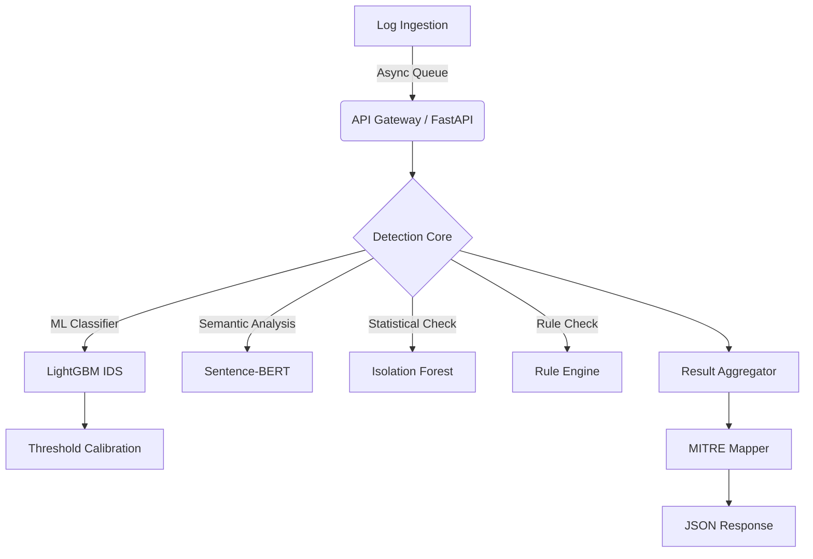

---

# AI-Augmented SOC Detection Engine


A modular Security Operations Center (SOC) detection engine combining supervised machine learning, anomaly detection, and rule-based logic to detect cyber threats in real-time. The system is designed with evaluation rigor, temporal validation, and deployment constraints in mind.

---

##  Key Capabilities

* Hybrid Detection Pipeline
  Combines ML-based classification with anomaly scoring and deterministic rules.

* Multi-Layer Threat Detection

  * Structured ML model (LightGBM) for flow-based intrusion detection
  * Sentence-BERT for semantic log understanding
  * Isolation Forest for anomaly detection
  * Rule engine for deterministic threat signatures

* MITRE ATT&CK Mapping
  Automatically maps detections to TTPs (e.g., T1110 – Brute Force).

* Temporal Evaluation Framework
  Supports both random and chronological data splits to measure generalization under distribution shift.

* Drift Monitoring
  Monitors embedding and feature drift to detect changes in traffic behavior.

* Production-Oriented Design
  Async FastAPI microservice, structured logging, Dockerized deployment.

---

##  System Architecture



---

##  Project Structure

```
src/
├── api/              # FastAPI application & endpoints
├── models/           # LightGBM IDS, BERT, Isolation Forest
├── detection/        # Core detection orchestration
├── rules/            # Rule-based detection logic
├── mitre/            # MITRE ATT&CK mapping
├── monitoring/       # Drift detection & calibration
├── evaluation/       # Benchmarking & temporal validation
└── utils/            # Preprocessing & helpers
scripts/              # Load testing & utilities
```

---

##  Installation & Setup

### Prerequisites

* Python 3.8+
* Docker (optional)

### Local Setup

1. Clone the repository
2. Install dependencies:

```bash
pip install -r requirements.txt
```

3. Train the model:

```bash
python train_siem.py
```

4. Start the API:

```bash
uvicorn src.api.main:app --reload
```

### Docker Deployment

```bash
docker-compose up --build -d
```

---

##  Performance

### Intrusion Detection (CIC-IDS2017)

Evaluation performed under two strategies:

| Split Strategy             | ROC-AUC                                        | Detection Rate | False Positive Rate |
| -------------------------- | ---------------------------------------------- | -------------- | ------------------- |
| Random Flow-Level          | ~0.999                                         | ~99.98%        | ~0.1%               |
| Chronological (Time-Based) | Evaluated to measure real-world generalization |                |                     |

Note: Chronological split simulates deployment by training on earlier capture days and testing on future traffic to reduce leakage effects.

### Inference Benchmark

* Single Sample Latency: ~3–5 ms (CPU)
* Throughput (Batch 32): ~4000 samples/sec
* Async API Throughput: ~200+ logs/sec per worker

---

##  Detection Capabilities

| Detection Layer | Technique         | Example                             |
| --------------- | ----------------- | ----------------------------------- |
| Flow-Based IDS  | LightGBM          | DDoS, DoS, PortScan, Brute Force    |
| Semantic        | Sentence-BERT     | Suspicious command patterns in logs |
| Statistical     | Isolation Forest  | Traffic volume anomalies            |
| Rule-Based      | Threshold/Pattern | 5 failed logins in 10s              |

---

##  Evaluation Philosophy

This project emphasizes:

* Impact of data splitting strategy on IDS performance
* Performance inflation under naive random splits
* Temporal validation to approximate deployment behavior
* Threshold calibration (Youden-J vs Max-F1)
* Per-class detection analysis for rare attacks

The goal is not just high metrics, but defensible and reproducible evaluation.

---

##  Running Evaluation

Benchmark:

```bash
python src/evaluation/benchmark.py
```

Load test:

```bash
python scripts/load_test.py
```

---

##  Roadmap

* [ ] Cross-dataset validation (UNSW-NB15 / CIC-IDS2018)
* [ ] Adaptive thresholding under drift
* [ ] Online learning module
* [ ] Entity graph anomaly detection

---

##  Authors

Rishit Sharma, 
Kokkula Srinivas
Detection Engineering | ML for Cyber Defense

---

