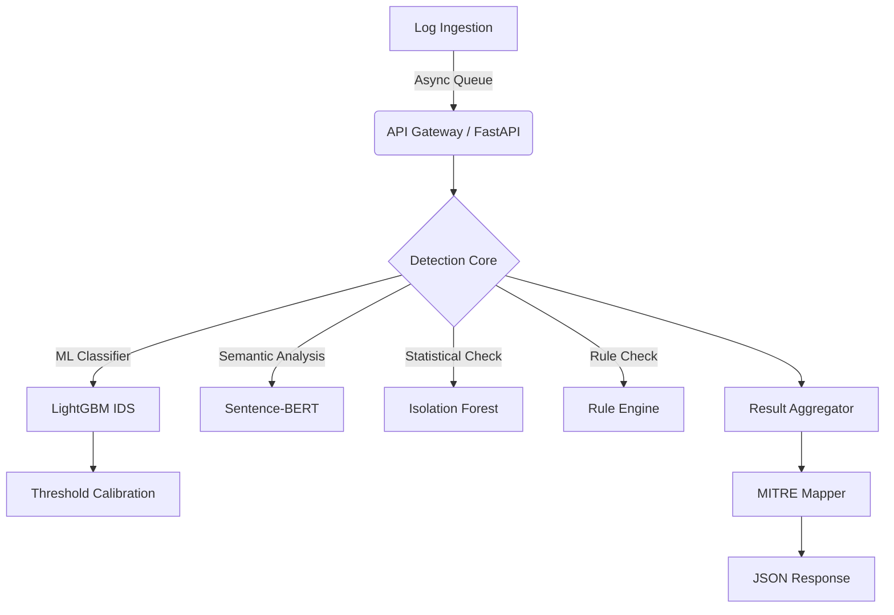

# System Architecture

The AI-Augmented SOC Detection Engine is a modular, high-throughput security microservice designed to ingest raw logs, analyze them through a hybrid detection pipeline, map alerts to the MITRE ATT&CK framework, and return structured JSON alerts.

---

## 🏗 System Topology

The diagram below illustrates the ingestion-to-alert flow. Log data enters through an asynchronous serving gateway, executes concurrently across multiple analytic models, and is aggregated before mapping to MITRE Tactics & Techniques.

---

## 🛡 Detection Layers

The detection core orchestrates four distinct analytical approaches to ensure coverage of volumetric, semantic, statistical, and signature-based threat signatures:

### 1. Flow-Based Machine Learning (LightGBM)
- **Purpose**: Detects network-level threats (DDoS, DoS, PortScan, Brute Force) using statistical properties of network sessions.
- **Model**: LightGBM classifier trained on 78 numeric flow features extracted from network capture files.
- **Features**: NetFlow/IPFIX metrics including Flow Duration, Packet Inter-Arrival Times (IAT), Packet Size statistics, and TCP flag counts.
- **Optimization**: Decision boundaries are dynamically calibrated (via Youden's J or Max-F1 optimization) to balance detection rate against the False Positive Rate (FPR) under temporal drift.

### 2. Semantic Log Analysis (Sentence-BERT)
- **Purpose**: Understands textual logs, CLI commands, and system event messages by identifying suspicious semantic context (even for novel obfuscated variations).
- **Model**: Sentence-BERT (SBERT) transformer fine-tuned to map command-line or application log strings to dense semantic vector spaces.
- **Features**: Cosine similarity measurements against pre-defined threat vectors or malicious patterns (e.g., credential access commands, process creation, shell execution).

### 3. Statistical Anomaly Check (Isolation Forest)
- **Purpose**: Identifies volumes, rates, or feature combinations that deviate significantly from historical benign traffic.
- **Model**: Unsupervised Isolation Forest.
- **Features**: Flow rate metrics, total packet volume per IP, and connection density.
- **Role**: Operates as a zero-shot anomaly detector that acts as a fallback for volumetric threats not represented in the LightGBM training distribution.

### 4. Deterministic Rule Engine
- **Purpose**: Catch signature-based threats with 100% confidence.
- **Technique**: Pattern matching, threshold rules, and stateful tracking (e.g., "5 failed SSH logins from a single IP within 10 seconds").

---

## 🔌 API Serving & Ingestion Layer

The microservice is built using **FastAPI** with production-oriented configurations:
- **Asynchronous Loop**: Utilizes python `async/await` to handle log streams concurrently without blocking.
- **Serving Architecture**:
  - Structured request ingestion `/api/v1/detect` receives single messages or batches.
  - An internal async task manager delegates parsing and queueing.
  - Health checks and metric endpoints expose runtime performance indicators.
- **Production Performance**:
  - Latency: ~3-5 ms single-sample CPU execution.
  - Throughput: Up to ~1500 flows/sec at batch size 32 on standard hardware.

---

## 🗺 MITRE ATT&CK Mapping

Results from the detection layers are routed through a mapping component:
- **Classification**: Normalizes detector signals into threat categories.
- **TTP Mapping**: Enriches alerts with corresponding MITRE Tactics and Techniques (e.g., T1110 for Brute Force, T1498 for Network Denial of Service).
- **Output**: Generates a unified JSON schema containing raw scores, binary flags, severity scores, and MITRE metadata, ensuring seamless integration with SIEM and SOAR platforms.

---

## 📈 Drift Monitoring Infrastructure

Concept drift and distribution shifts are managed via a dedicated monitoring pipeline under `src/monitoring/`:
1. **Multi-Channel Drift Detector (`DriftMonitor`)**:
   - Computes sliding window z-scores over vector norms and raw predictions to flag shifts in traffic patterns.
2. **Feature Distribution Analyzer (`drift_baseline.py`)**:
   - Compares production feature distributions against baseline training statistics (mean, std, skew, kurtosis, quantiles) using Population Stability Index (PSI) and Kolmogorov-Smirnov (KS) tests.
3. **Adaptive Threshold Controller (`adaptive_threshold.py`)**:
   - Updates decision boundaries automatically based on quantile tracking, including bounded updates and incident-aware freezing to prevent threshold manipulation during active campaigns.
